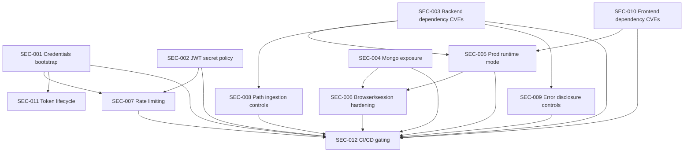

# Hardening Implementation Plan

## Scope and Guardrails
- Source artifacts used:
  - `README_SECURITY_HARDENING.md`
  - `SECURITY_AUDIT_REPORT.md`
  - `MACHINE_READABLE_SECURITY_PLAN.json`
  - `CHANGE_RECOMMENDATIONS.md`
- Hard rule:
  - Do not execute performance optimization work until all pre-deployment security fixes are complete and verified.
- Deployment gate:
  - Pre-deploy fixes: `SEC-001` to `SEC-010`, `SEC-012`.
  - Immediate post-deploy hardening: `SEC-011`.

## Execution Status (2026-03-28)
- `B1` Credentials and startup secret policy: Completed in repo.
- `B2` Dependency CVE remediation and upload guards: Completed in repo.
- `B3` File path and error disclosure controls: Completed in repo.
- `B4` Production runtime and data-store exposure hardening: Completed in repo.
- `B5` Auth abuse protection and browser session hardening: Completed in repo.
- `B6` CI/CD security gates: Completed in repo.
- `B7` Token lifecycle hardening: Completed in repo (with legacy token compatibility migration).

Open validation notes:
- Runtime/infrastructure checks still required in staging/prod for external Mongo reachability, edge TLS/header enforcement, and branch protection wiring.
- Local environment currently lacks `pytest`; security test files compile successfully, but full pytest execution must run in CI or a dev image with test dependencies installed.

## Workstream Separation
- Must-fix security work:
  - `SEC-001`, `SEC-002`, `SEC-003`, `SEC-004`, `SEC-005`, `SEC-006`, `SEC-007`, `SEC-008`, `SEC-009`, `SEC-010`, `SEC-012`
- Safe refactors (only after must-fix set is complete):
  - Modularize `hospitality/service.py` into bounded submodules.
  - Centralize backend error handling and security logging hooks.
  - Introduce dedicated security config/policy module.
- Optimization opportunities (only after hardening + refactor baseline):
  - Upload pipeline streaming/perf.
  - Reconciliation/report query performance.
  - Container image/runtime optimization.

## Dependency Map

## Safe Implementation Batches

## Batch 1: Credential and Secret Baseline (Must-Fix)
- Fixes:
  - `SEC-001`, `SEC-002`
- Target files:
  - `backend/app/core/config.py`
  - `backend/app/domains/users/service.py`
  - `frontend/src/config/app.ts`
  - `frontend/src/pages/login-page.tsx`
  - `docker-compose.yml`
  - `README.md`
- Implementation order:
  1. Remove default admin values from frontend and docs.
  2. Stop startup password re-application for master admin.
  3. Add fail-fast validation for weak/default JWT/admin credentials in non-local environments.
  4. Remove credential overrides from runtime compose defaults.
- Tests to add/update:
  - `backend/tests/security/test_startup_config_guards.py`
  - `backend/tests/security/test_master_admin_bootstrap_behavior.py`
  - `frontend/src/pages/login-page.test.tsx` (assert no default credential render/prefill)
- Rollback risk:
  - Medium (startup behavior changes can break current bootstrap assumptions).
  - Rollback plan: feature-flag strict startup checks (`APP_ENV` gated) and provide one-time admin init command.
- Isolated PR safety:
  - Yes. Recommended as 2 PRs:
    - PR-A: frontend/docs credential removal
    - PR-B: backend startup/bootstrap logic

## Batch 2: Dependency and Parser Hardening (Must-Fix)
- Fixes:
  - `SEC-003`, `SEC-010`
- Target files:
  - `backend/requirements.txt`
  - `frontend/package.json`
  - `frontend/package-lock.json`
  - `backend/app/domains/hospitality/service.py` (guardrails in same batch)
- Implementation order:
  1. Upgrade backend vulnerable packages and resolve transitive compatibility.
  2. Upgrade frontend toolchain and regenerate lockfile.
  3. Add explicit upload size/type guard constants and early rejection behavior.
  4. Re-run dependency audits and record outputs in CI artifacts.
- Tests to add/update:
  - `backend/tests/security/test_upload_limits.py`
  - `backend/tests/security/test_parser_failure_resilience.py`
  - CI job: `pip-audit` + `npm audit` thresholds
- Rollback risk:
  - Medium-High (dependency upgrades may change runtime behavior).
  - Rollback plan: pin last known-good versions per package and roll forward package-by-package with compatibility matrix.
- Isolated PR safety:
  - Partially. Recommended as 2 PRs:
    - PR-C: backend deps + backend guard tests
    - PR-D: frontend deps + frontend build/audit validation

## Batch 3: File Handling and Error Disclosure Controls (Must-Fix)
- Fixes:
  - `SEC-008`, `SEC-009`
- Target files:
  - `backend/app/domains/hospitality/service.py`
  - `backend/app/domains/hospitality/router.py`
- Implementation order:
  1. Restrict or disable path ingestion endpoints in production mode.
  2. Add allowlisted path root enforcement for any retained seed flow.
  3. Replace raw exception strings in HTTP responses with generic errors.
  4. Add structured server-side logs with correlation IDs.
- Tests to add/update:
  - `backend/tests/security/test_seed_path_allowlist.py`
  - `backend/tests/security/test_error_response_sanitization.py`
- Rollback risk:
  - Medium (existing admin workflows may rely on unrestricted path ingestion).
  - Rollback plan: keep endpoint behind explicit feature flag and allow temporary fallback in internal-only environments.
- Isolated PR safety:
  - Yes, if path-ingestion and error-sanitization changes are done in the same PR to avoid partial regressions.

## Batch 4: Runtime and Infrastructure Hardening (Must-Fix)
- Fixes:
  - `SEC-005`, `SEC-004`
- Target files:
  - `backend/Dockerfile`
  - `frontend/Dockerfile`
  - `docker-compose.yml`
  - deployment profiles (if introduced)
- Implementation order:
  1. Convert backend runtime to production command (no reload).
  2. Build frontend static assets and serve via production server image.
  3. Run containers as non-root users.
  4. Remove Mongo host exposure in prod profile and enforce auth/TLS settings.
- Tests to add/update:
  - `ops/tests/test_container_user_nonroot.sh`
  - `ops/tests/test_compose_prod_surface.sh` (assert no dev ports/mounts)
  - staging smoke test for DB connectivity/auth only via expected network
- Rollback risk:
  - High (deployment/runtime profile changes impact release paths).
  - Rollback plan: maintain explicit `dev` and `prod` compose profiles and perform staged rollout with blue/green smoke checks.
- Isolated PR safety:
  - Yes, but run as dedicated infra PR with staging validation before merge.

## Batch 5: Auth Abuse and Browser Session Hardening (Must-Fix)
- Fixes:
  - `SEC-007`, `SEC-006`
- Target files:
  - `backend/app/main.py`
  - `backend/app/domains/auth/router.py`
  - `backend/app/domains/auth/dependencies.py`
  - `backend/app/core/security.py`
  - `frontend/src/api/client.ts`
  - edge proxy config (runtime)
- Implementation order:
  1. Add rate limiting and lockout/backoff for login and token-sensitive endpoints.
  2. Restrict CORS origin list and credentials policy.
  3. Apply security header policy (CSP/frame/content-type/HSTS at edge).
  4. Migrate from localStorage bearer tokens to secure cookie strategy (or enforce CSP hardening if migration deferred).
- Tests to add/update:
  - `backend/tests/security/test_auth_rate_limit.py`
  - `backend/tests/security/test_cors_policy.py`
  - integration tests for cookie/session auth flows
  - e2e tests for login/logout/session persistence
- Rollback risk:
  - High (auth/session model changes can break all clients).
  - Rollback plan: temporary dual-mode auth support (cookie + bearer) behind feature flag and staged frontend cutover.
- Isolated PR safety:
  - Not fully for token storage migration; split into:
    - PR-E: rate limiting + CORS
    - PR-F: session strategy migration with coordinated frontend/backend release

## Batch 6: CI/CD Security Gating (Must-Fix)
- Fixes:
  - `SEC-012`
- Target files:
  - `.github/workflows/*` (or equivalent CI system definitions)
  - policy config files (`.trivyignore`, audit policy, etc.)
- Implementation order:
  1. Add dependency audit jobs (`pip-audit`, `npm audit`).
  2. Add secret scanning and SAST jobs.
  3. Add container/IaC scanning and merge blocking thresholds.
  4. Enforce protected-branch required checks.
- Tests to add/update:
  - CI self-test pipeline with intentional vulnerable fixture branch.
- Rollback risk:
  - Low-Medium (pipeline friction/false positives).
  - Rollback plan: start with warn mode for 1 cycle, then enforce blocking thresholds.
- Isolated PR safety:
  - Yes, dedicated DevSecOps PR.

## Batch 7: Immediate Post-Deploy Token Lifecycle Hardening
- Fixes:
  - `SEC-011`
- Target files:
  - `backend/app/domains/password_resets/*`
  - `backend/app/domains/invitations/*`
  - `backend/app/domains/auth/router.py`
  - `frontend/src/pages/password-reset-page.tsx`
- Implementation order:
  1. Introduce token hashing at rest with backward-compatible migration.
  2. Remove token echoing where possible and reduce URL-token exposure.
  3. Validate log redaction for token-bearing routes.
- Tests to add/update:
  - `backend/tests/security/test_token_hash_storage.py`
  - `backend/tests/security/test_reset_token_single_use.py`
  - integration tests asserting tokens are not present in API response bodies where not required
- Rollback risk:
  - Medium (token validation flow change can invalidate active links).
  - Rollback plan: temporary dual-lookup (legacy plaintext + new hash) with short migration window.
- Isolated PR safety:
  - Yes, if migration compatibility is included in same PR.

## Implementation Order Summary
1. Batch 1
2. Batch 2
3. Batch 3
4. Batch 4
5. Batch 5
6. Batch 6
7. Batch 7

## PR Strategy
- Keep PRs small and reversible, one security objective per PR.
- Label PRs by class: `security/must-fix`, `security/runtime`, `security/ci`, `security/post-deploy`.
- Require passing tests + audit jobs before merge.

## Release Gates
- Gate A (before production cut): Batches 1-6 complete.
- Gate B (within first hardening sprint after go-live): Batch 7 complete.
- Optimization gate: only open after Gate A is complete and verified.
