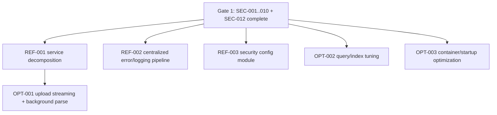

# Optimization After Hardening

## Purpose
This plan defines refactor and optimization work that is safe only after mandatory security hardening is complete.

## Hard Gates Before Any Optimization
- Gate 1 (required): Complete and verify all pre-deployment security fixes: `SEC-001`, `SEC-002`, `SEC-003`, `SEC-004`, `SEC-005`, `SEC-006`, `SEC-007`, `SEC-008`, `SEC-009`, `SEC-010`, `SEC-012`.
- Gate 2 (required): CI security gates enforce blocking thresholds for high/critical findings.

If Gate 1 is not complete, optimization work is blocked.

Current status (2026-03-28):
- Gate 1 implementation work is complete in repository code/config.
- Gate 2 workflow definitions are present in `.github/workflows/security-gates.yml`.
- Remaining prerequisite before optimization sprints: execute runtime verification in staging/prod and confirm branch-protection wiring in GitHub settings.

## Separation of Work
- Must-fix security work: tracked in `HARDENING_IMPLEMENTATION_PLAN.md` and `SECURITY_FIX_BACKLOG.json`.
- Safe refactors: structural cleanup that preserves behavior and supports safer optimization.
- Optimization opportunities: performance/cost/maintainability improvements, scheduled only after hardening.

## Dependency Graph

## Safe Refactor Batches

## Refactor Batch R1: Hospitality Service Decomposition
- Depends on: `SEC-003`, `SEC-008`, `SEC-009`
- Target files:
  - `backend/app/domains/hospitality/service.py`
  - new modules under `backend/app/domains/hospitality/` (parser/validation/errors)
- Implementation order:
  1. Extract pure validation helpers.
  2. Extract parser orchestration and error mapping.
  3. Keep API and behavior stable.
- Tests to add/update:
  - update existing hospitality unit tests for module boundaries
  - `backend/tests/security/test_parser_failure_resilience.py`
  - `backend/tests/security/test_error_response_sanitization.py`
- Rollback risk: Medium (regression risk from code movement).
- Isolated PR safe: Yes.

## Refactor Batch R2: Centralized Error Handling and Security Logging
- Depends on: `SEC-009`
- Target files:
  - `backend/app/main.py`
  - `backend/app/domains/*/router.py`
  - shared error/logging utilities in `backend/app/core/`
- Implementation order:
  1. Add shared exception-to-response mapping.
  2. Route domain handlers through centralized helpers.
  3. Standardize correlation IDs across logs.
- Tests to add/update:
  - integration tests for standardized error responses
  - regression tests for log redaction paths
- Rollback risk: Small-Medium (primarily response-format compatibility).
- Isolated PR safe: Yes.

## Refactor Batch R3: Dedicated Security Configuration Module
- Depends on: `SEC-001`, `SEC-002`
- Target files:
  - `backend/app/core/config.py`
  - `backend/app/core/security.py`
  - `backend/app/main.py`
- Implementation order:
  1. Move security-critical settings into dedicated policy module.
  2. Keep startup validation hooks unchanged.
  3. Remove duplicated security checks from feature modules.
- Tests to add/update:
  - `backend/tests/security/test_startup_config_guards.py`
  - config unit tests for env-specific policy behavior
- Rollback risk: Small.
- Isolated PR safe: Yes.

## Optimization Batches (Only After Refactor Baseline)

## Optimization Batch O1: Upload Ingestion Throughput
- Depends on: `REF-001` and `SEC-003`, `SEC-008`
- Target files:
  - `backend/app/domains/hospitality/service.py`
  - parser worker/background processing modules
- Implementation order:
  1. Introduce streaming/chunked ingestion with explicit limits.
  2. Shift heavy parsing to bounded background jobs.
  3. Add queue-level retry/time-limit guards.
- Tests to add/update:
  - load tests for large-file ingestion
  - timeout and memory ceiling tests
  - abuse tests to confirm security guards are still enforced
- Rollback risk: High (pipeline architecture change).
- Isolated PR safe: No (requires coordinated backend runtime and job infrastructure changes).

## Optimization Batch O2: Query and Index Tuning
- Depends on: `SEC-004`, `SEC-005`
- Target files:
  - `backend/app/domains/hospitality/repository.py`
  - migration/index files
- Implementation order:
  1. Profile slow queries in staging with production-like data.
  2. Add/adjust indexes with explicit migration scripts.
  3. Validate query-plan improvements and write-amplification impact.
- Tests to add/update:
  - integration tests for query correctness and pagination stability
  - performance baseline/threshold tests in staging CI
- Rollback risk: Medium (index choices can affect writes/storage).
- Isolated PR safe: Yes.

## Optimization Batch O3: Container and Startup Efficiency
- Depends on: `SEC-005`
- Target files:
  - `backend/Dockerfile`
  - `frontend/Dockerfile`
  - deployment manifests/profiles
- Implementation order:
  1. Multi-stage build refinements and artifact minimization.
  2. Startup path and healthcheck optimization.
  3. Resource request/limit tuning from observed runtime metrics.
- Tests to add/update:
  - image scan and size threshold checks
  - cold-start smoke tests
  - runtime memory/cpu baseline checks
- Rollback risk: Small-Medium.
- Isolated PR safe: Yes.

## PR and Rollback Rules
- Keep one objective per PR (single refactor or optimization batch item).
- Require green security gates on all optimization PRs.
- For high-risk batches (`O1`), use feature flags and staged rollout.
- Maintain rollback scripts for DB/index and deployment profile changes.

## Exit Criteria
- Security posture remains unchanged or improved in all optimization PRs.
- No increase in high/critical findings from CI scans.
- Performance goals are met with no regression in auth, input validation, or error sanitization behavior.
